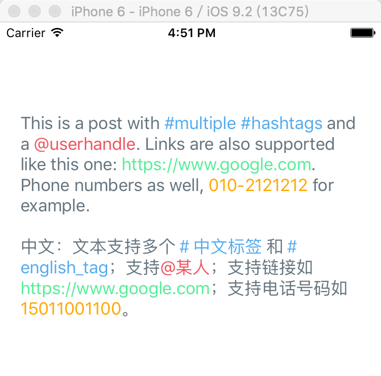

Original from https://github.com/optonaut/ActiveLabel.swift. 
Add phoneNumber support. And it works with Chinese language now. 

UILabel drop-in replacement supporting Hashtags (#), Mentions (@), URLs (http://) and PhoneNumbers written in Swift

## Features

* Swift 2+
* Support for **Hashtags, Mentions, Links and PhoneNumbers**
* Super easy to use and lightweight
* Works as `UILabel` drop-in replacement
* Well tested and documented




## Usage

```swift
import ActiveLabel

let label = ActiveLabel()

label.numberOfLines = 0
label.text = "This is a post with #hashtags and a @userhandle."
label.textColor = .blackColor()
label.handleHashtagTap { hashtag in
  print("Success. You just tapped the \(hashtag) hashtag")
}
```

## API

##### `mentionEnabled: Bool = true`
##### `hashtagEnabled: Bool = true`
##### `URLEnabled: Bool = true`
##### `mentionColor: UIColor = .blueColor()`
##### `mentionSelectedColor: UIColor?`
##### `hashtagColor: UIColor = .blueColor()`
##### `hashtagSelectedColor: UIColor?`
##### `URLColor: UIColor = .blueColor()`
##### `URLSelectedColor: UIColor?`
##### `lineSpacing: Float?`

##### `handleMentionTap: (String) -> ()`

```swift
label.handleMentionTap { userHandle in print("\(userHandle) tapped") }
```

##### `handleHashtagTap: (String) -> ()`

```swift
label.handleHashtagTap { hashtag in print("\(hashtag) tapped") }
```

##### `handleURLTap: (NSURL) -> ()`

```swift
label.handleURLTap { url in UIApplication.sharedApplication().openURL(url) }
```
